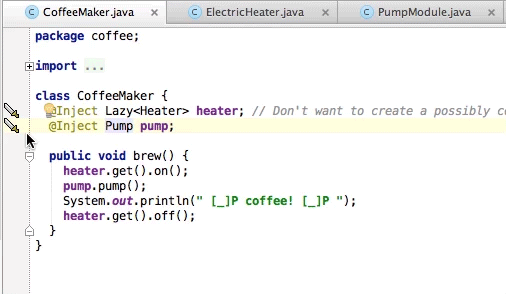

Dagger IntelliJ IDEA Plugin
===========================

[Dagger](https://square.github.io/dagger) can provide a Class objects without needing to know how they are constructed. The Dagger IntelliJ plugin helps demystify this behavior and creates visual connections between a @Inject object and the @Provides method that creates it.

Download
--------

// TODO

License
=======

    Copyright 2013 Square, Inc.

    Licensed under the Apache License, Version 2.0 (the "License");
    you may not use this file except in compliance with the License.
    You may obtain a copy of the License at

       http://www.apache.org/licenses/LICENSE-2.0

    Unless required by applicable law or agreed to in writing, software
    distributed under the License is distributed on an "AS IS" BASIS,
    WITHOUT WARRANTIES OR CONDITIONS OF ANY KIND, either express or implied.
    See the License for the specific language governing permissions and
    limitations under the License.
